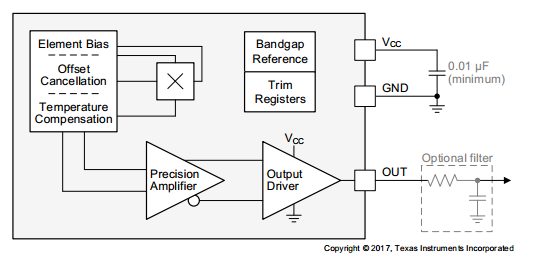
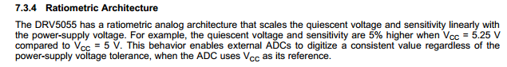
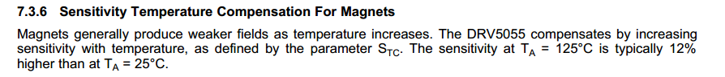
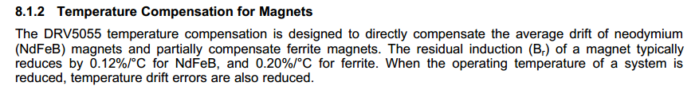

[TOC]

### motor problems

#### 001. Three phase bldc 三相霍尔位置[N]

#### 002. 磁阻效应与霍尔效应的区别[N]

#### 003. 什么是凸极效应？[N]

#### 004. 步进电机驱动应该用stm32的什么外设？两个timer么？[N]

#### 005. 定子励磁型无刷直流电机系统的工作原理与结构？[N]

#### 006. 三角形连接的零序电流？[N]

#### 007. 线性霍尔的原理？[N]
Take DRV5055 as an example:

$$
V_{out} = V_Q + B*(Sensitivity_{(25^oC)}*(1+S_{TC}*(T_A-25^oC)))
$$

$S_{TC}$ is typically $0.12\%/^oC$ 

#### 008. 线性霍尔位置检测原理和精度（resolution and INL)[N]

#### 009. 单相直流无刷直流电机模型？

#### 010. 直流有刷电机结构？

#### 011. 重要电机性能参数有哪些？[N]

#### 012. 什么是电枢？什么是电枢磁场？

#### 013. 集中绕组和分布绕组绕线的区别？

#### 014. 分数槽绕线？

#### 015. 同步发电机如何保证电压为正弦，发电端允许有多大的电压畸变？[N]

#### 016. 同步电机双反应同步电机的直轴与交轴分别跟定子磁场方向有什么关系？[N]
