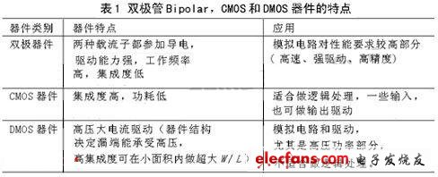

[TOC]

### Electronics

#### 001. ADC的种类有哪些？各有什么优缺点？[N]
#### 002. ADC怎么做到高精度和高速度？有什么折中？[N]
#### 003. 电解电容为什么不能反接？[N]
#### 004. JFET 特性
#### 005. 反激变换器开关时谐振过程
#### 006. 反向恢复的原理，造成哪些影响？
#### 007. 垂直结构MOSFET
#### 008. 米勒效应原理
#### 009. 为什么共基极放大电路的频带较宽？和米勒效应有关吗？
#### 010. 场效应管id与gs电压的关系
#### 011. 纵向晶体管与横向晶体管的区别？
#### 012. CMOS的含义？
#### 013. BCD工艺的含义
#### 014. 集成运放为什么都采用直接耦合方式？？
（因为集成电路无法集成大电容和电感）而且集成电路相邻元件具有良好的一致性，因此经常采用各种查分放大电路（作为输入级）和恒流源电路（作为偏置电路或有缘负载）
#### 015. 硅片上为什么不宜制作高阻值电阻？
#### 016. 互补输出电路？
#### 017. 二极管的开启电压？和PN结相同么？
#### 018. 稳压管的结构和制造？
#### 019. TVS的结构和制造？
#### 020. 肖特基的结构与制造
#### 021. 陀螺仪芯片的原理？
#### 022. 二极管压降检测温度？
#### 023. 菊花链结构？
#### 024. 冯诺依曼结构与哈弗结构的优缺点？
#### 025. 现在DSP对于ARM的优点在哪？
#### 026. CRC校验原理
#### 027. what is avalanche breakdown?
#### 028. 555电路工作原理与仿真
#### 029. Op amp 种类和各自优缺点？
#### 030. 什么是BCD工艺？MPS工艺有什么优点，为什么？

（Bipolar-CMOS-DMOS Process) 在同一芯片上制作双极管，CMOS和DMOS器件，称作BCD工艺。

**Bipolar** for precise analog functions, CMOS (**Complementary Metal Oxide 
Semiconductor**) for digital design and DMOS (**Double Diffused Metal Oxide 
Semiconductor**) for power and high-voltage elements.

综合了双极器件高跨导、强负载驱动能力和CMOS集成度高、低功耗的优点，使其互相取长补短，发挥各自的优点。更为重要的是，它集成了DMOS功率器件，DMOS可以在开关模式下工作，功耗极低。不需要昂贵的封装和冷却系统就可以将大功率传递给负载。低功耗是BCD工艺的一个主要优点之一。

BCD工艺典型器件包括低压CMOS管、高压 MOS管、各种击穿电压的LDMOS、垂直NPN管、垂直PNP管、横向PNP管、肖特基二极管、阱电阻、多晶电阻、金属电阻等;有些工艺甚至还集成了EEPROM、结型场效应管JFET等器件。由于集成了如此丰富的器件，这就给电路设计者带来极大的灵活性，可以根据应用的需要来选择最合适的器件，从而提高整个电路的性能。

由于BCD工艺中器件种类多，必须做到高压器件和低压器件的兼容;双极工艺和CMOS工艺的相兼容，尤其是要选择合适的隔离技术;为控制制造成本，必须考虑光刻版的兼容性。考虑到器件各区的特殊要求，为减少工艺制造用的光刻版，应尽量使同种掺杂能兼容进行。因此，需要精确的工艺模拟和巧妙的工艺设计，有时必须在性能与集成兼容性上作折中选择。通常BCD采用双阱工艺，有的工艺会采用三阱甚至四阱工艺来制作不同击穿电压的高压器件。

功率输出级DMOS管是此类电路的核心，往往占据整个芯片面积的1/2～2/3，它是整个集成电路的关键。DMOS与CMOS器件结构类似，也有源、漏、栅等电极，但是漏端击穿电压高。  DMOS主要有两种类型，垂直双扩散金属氧化物半导体场效应管VDMOSFET( vertical double-diffused  MOSFET)和横向双扩散金属氧化物半导体场效应管LDMOSFET (lateral double-diffused MOSFET)。LDMOS由于更容易与CMOS工艺兼容而被广泛采用。

DMOS器件是由成百上千的单一结构的DMOS  单元所组成的。这些单元的数目是根据一个芯片所需要的驱动能力所决定的，DMOS的性能直接决定了芯片的驱动能力和芯片面积。对于一个由多个基本单元结构组成的LDMOS器件，其中一个最主要的考察参数是导通电阻，用R  ds(on)表示。导通电阻是指在器件工作时，从漏到源的电阻。对于  LDMOS器件应尽可能减小导通电阻，就是BCD工艺流程所追求的目标。当导通电阻很小时，器件就会提供一个很好的开关特性，因为漏源之间小的导通电阻，会有较大的输出电流，从而可以具有更强的驱动能力。DMOS的主要技术指标有：导通电阻、阈值电压、击穿电压等。

 　　对LDMOS而言，外延层的厚度、掺杂浓度、漂移区的长度是其最重要的特性参数。我们可以通过增加漂移区的长度以提高击穿电压，但是这会增加芯片面积和导通电阻。高压DMOS器件耐压和导通电阻取决于外延层的浓度、厚度及漂移区长度的折中选择。因为耐压和导通阻抗对于外延层的浓度和厚度的要求是矛盾的。高的击穿电压要求厚的轻掺杂外延层和长的漂移区，而低的导通电阻则要求薄的重掺杂外延层和短的漂移区，因此必须选择最佳外延参数和漂移区长度，以便在满足一定的源漏击穿电压的前提下，得到最小的导通电阻。另外，由于DMOS芯片面积大，对缺陷密度较敏感。

BCD工艺发展方向

 	　　BCD工艺技术的发展不像标准CMOS工艺那样，一直遵循Moore定律向更小线宽、更快的速度方向发展。BCD工艺朝着三个方向分化发展：高压、高功率、高密度。

 	　　⑴高压BCD

 	　　主要的电压范围是500～700V，目前用来制造LDMOS的唯一方法为RESURF技术，原意为降低表面电场( reduced surface   field)[9-10]，在1979年由J.A.Appels等人提出。它是利用轻掺杂的外延层制作器件，使表面电场分布更加平坦从而改善表面击穿的特性，使击穿发生在体内而非表面,从而提高器件的击穿电压。高压BCD主要的应用领域是电子照明(  electronic lamp ballasts)和工业应用的功率控制。

 	　　⑵高功率BCD

 	　　主要的电压范围是40～90V，主要的应用为汽车电子。它的需求特点是大电流驱动能力、中等电压，而控制电路往往比较简单。因此主要发展趋势

 	　　侧重于提高产品的鲁棒性(robustness)，以保证在恶劣的环境下应用能够具备良好的性能和可靠性;另一个方面是如何降低成本。

 	　　⑶高密度BCD

 	 　　主要的电压范围是5～50V，一些汽车电子应用会到70V。在此应用领域，BCD技术将集成越来越复杂的功能，今天，有的产品甚至集成了非挥发性存储器。许多电路集成密度如此之高，以致于需要采用数字设计的方法(如集成微控制器)来实现最佳驱动以提高性能。这代表了持续增长的市场需求，即将信号处理器和功率激励部分同时集成在同一块芯片上。它不仅仅是缩小了系统体积和重量，更带来了高可靠性，减少了各种电磁接口。由于有着非常广阔的市场应用前景，代表了BCD工艺的主流方向，也是最大的应用领域。

 	 　　最新的BCD工艺趋向于采用先进的CMOS工艺平台，根据不同的应用场合呈现模块化和多样性的特点。高密度BCD工艺发展的一个显著趋势是模块化的工艺开发策略被普遍采用。所谓模块化，是指将一些可选用的器件做成标准模块，根据应用需要选用或省略该模块。模块化代表了BCD工艺发展的一个显著特征，采用模块化的开发方法，可以开发出多种不同类型的IC，在性能、功能和成本上达到最佳折中，从而方便地实现产品的多样化，快速满足持续增长的市场需求。自0.6μm线宽以下BCD工艺普遍采用双栅氧，薄栅氧实现低压CMOS，厚栅氧用于制造高压DMOS。此外，一种新型的大斜角注入工艺正被采用以减少热过程。

